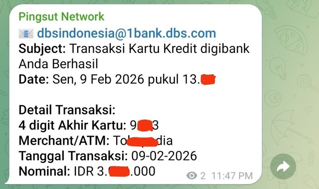

# Email Parser Worker

A Cloudflare Worker that parses incoming emails **Transaction Notification from DBS** using `postal-mime` and forwards transaction details to Telegram and WhatsApp (via WAHA).

## Features
- Parses extracting:
  - **Sender** (Original sender if forwarded)
  - **Subject**
  - **4 digit Akhir Kartu**
  - **Merchant/ATM**
  - **Tanggal Transaksi**
  - **Nominal**
- Sends formatted notifications to Telegram.
- Forwards the same notification to a WhatsApp group via WAHA.
- Supports handling forwarded emails (extracts original details).

```json
--- Extracted Data ---
{
  "akhirKartu": "XXXX",
  "merchant": "DANA QR * Lo MXX MXXXX",
  "tanggalTransaksi": "03-02-2026",
  "nominal": "IDR 2.XXX.086"
}
```



## Setup

1.  **Install Dependencies**:
    ```bash
    npm install
    ```

2.  **Local Testing**:
    You can test with a local `.eml` file:
    ```bash
    npm run test:local
    ```
    Ensure you have `Transaksi Kartu Kredit digibank Anda Berhasil.eml` or `Fwd_Transaksi Kartu Kredit digibank Anda Berhasil.eml` in the root.

3.  **Secrets Configuration**:
    For local development, create a `.dev.vars` file:
    ```ini
    TELEGRAM_BOT_TOKEN="your_token"
    TELEGRAM_CHAT_ID="your_chat_id"
    TELEGRAM_TOPIC_ID="your_topic_id"  # optional, for Telegram forum topic
    WA_API_URL="https://your-waha-server"
    WA_API_KEY="your_waha_api_key"
    WA_GROUP_ID="your_whatsapp_group_id"
    WA_SESSION="default"  # optional, defaults to "default"
    ```

## Deployment

1.  **Authenticate**:
    ```bash
    npx wrangler login
    ```

2.  **Set Secrets** (Production):
    Run the following commands and enter values when prompted:
    ```bash
    npx wrangler secret put TELEGRAM_BOT_TOKEN
    npx wrangler secret put TELEGRAM_CHAT_ID
    npx wrangler secret put TELEGRAM_TOPIC_ID  # optional
    npx wrangler secret put WA_API_URL
    npx wrangler secret put WA_API_KEY
    npx wrangler secret put WA_GROUP_ID
    npx wrangler secret put WA_SESSION  # optional
    ```
    *Note: You can also set these in the Cloudflare Dashboard under Worker > Settings > Variables and Secrets.*

3.  **Deploy**:
    ```bash
    npm run deploy
    ```

## Project Structure
- `src/index.ts`: Main worker logic.
- `scripts/test-local.ts`: Local testing script.
